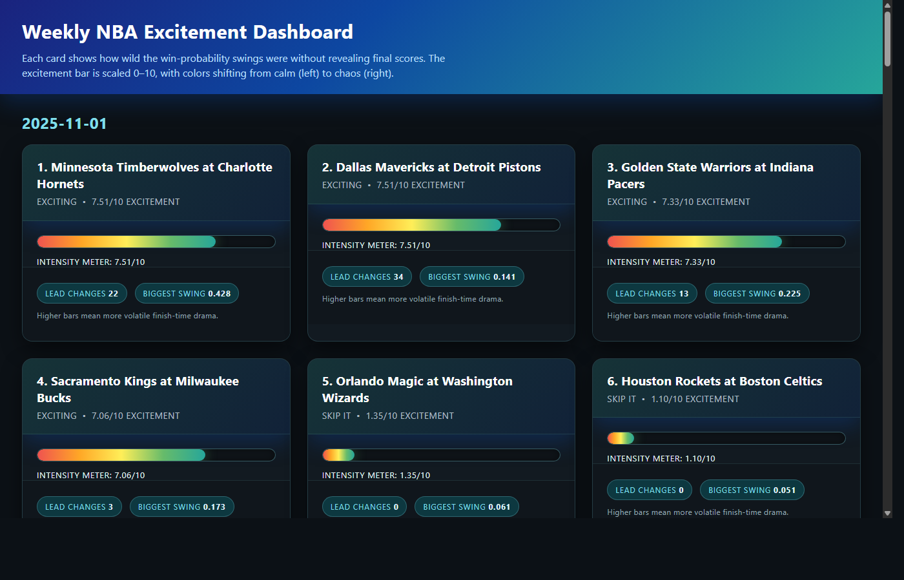
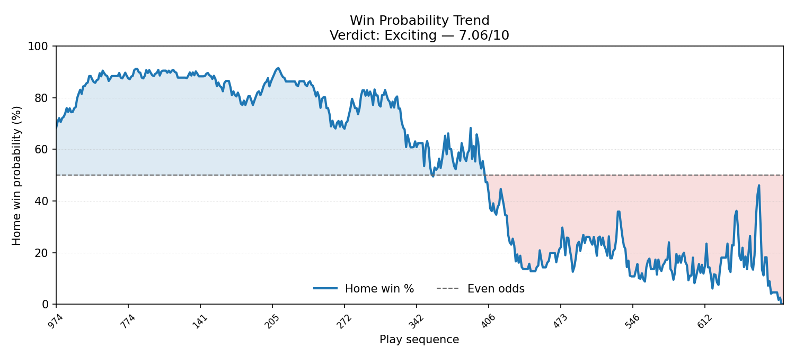

# Watch Worthy

Watch Worthy ranks NBA games by their win-probability chaos so you can decide
which replays deserve a spot on your watch list. Feed it an ESPN game summary
(`box.json` in this repo) to score the swings and render a spoiler-safe chart.

## Browse the weekly dashboard

Running `generate_weekly_plots.py` produces a spoiler-safe HTML landing page at
`plots/index.html`. Here's what the dashboard looks like out of the box:



If you regenerate the dashboard locally and want to refresh the screenshot,
render it from WSL with headless Chrome:

```bash
powershell.exe -Command "& 'C:\\Program Files\\Google\\Chrome\\Application\\chrome.exe' \
  --headless=new --disable-gpu --window-size=1400,900 \
  --screenshot='C:/Users/spier/excitinggame/plots/dashboard.png' \
  'file:///C:/Users/spier/excitinggame/plots/index.html'"
```

## Prerequisites

- Python 3.10+
- `matplotlib` for chart rendering:
  ```bash
  python3 -m pip install matplotlib
  ```

## Run the analyzer

```bash
python3 exciting_game.py
```

Latest result:

```
$ python3 exciting_game.py
Verdict: Exciting (7.06/10)
Lead changes: 3
Average swing: 0.024
Largest swing: 0.173
Time in toss-up range (45%-55%): 3.09%
```

## Generate the win-probability chart

```bash
mkdir -p plots
python3 plot_winprobability.py box.json --output plots/box_winprobability.png
```

The rendered chart (based on the same sample payload) lives at
`plots/box_winprobability.png` and looks like this:


